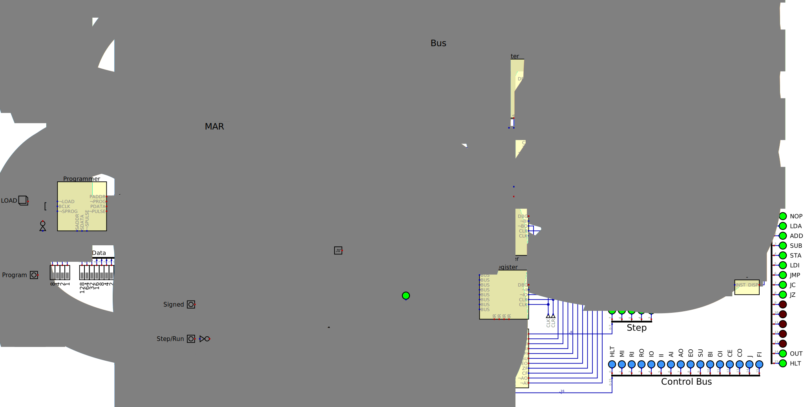

# 8bitsim
A simulation of Ben Eater's 8 bit computer running in the logic simulator called _Digital_.

### My Goal ###

### Guiding Principles ###
* Fidelity to the original design
* Use submodules to keep the main layout clean

### Compromises ###
* Clock Circuit

### Enhancements ###
* Bootstrapping

### Suggestions ###
My first suggest is - buy the parts (better yet, buy a kit from Ben) and build the real thing.  This is a non-trival circuit and the time you invest in building something physical you can hold and share with others will bring great satisfaction.

If you decide to build the virtual verion then I suggest you DO NOT download the files from this repository.  Instead you should create the circuits yourself - placing the components and wiring them together.  __The leaning is in the doing__.  Use the files I provide here as reference if you get stuck.

### Links ###
* Digital - https://github.com/hneemann/Digital
* 8 Bit Computer - https://eater.net/8bit

### Layouts ###
#### Main ####

