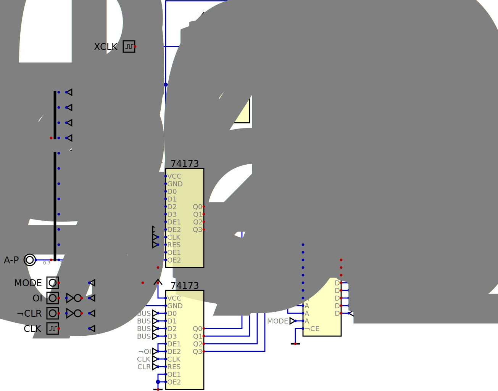

# 8bitsim
A simulation of Ben Eater's 8 bit computer running in the logic simulator called _Digital_.

### My Goal ###
The goal was to see if I could build a _virtual_ version of Ben Eater's 8 bit computer he documents on his website.

### Guiding Principles ###
* __Fidelity to the original design__ - by closely following Ben's design it 1) made it easier for me to debug the circuits as I assembled them and 2) makes it easier for others to follow along with Ben's material.
* __Keep the main circuit abstract__ - by pushing the detail into subcircuits the main circuit becomes an abstraction of the machine.  That's help in understanding how it operates.

### Compromises ###
* __Clock Circuit__ - _Digital_, the simulation software used in this project, is designed to simulate digital logic circuits and does not support the 555 time chip since it requires analog components to operate.  The included circuit that replaces Ben's original circuit provides the same inputs (HLT) and the same outputs (CLK and ~CLK).

### Enhancements ###
* __Programming__ - While debugging the circuits I found the change/test cycle was slowed by having to re-enter the test program each iteration.  The programming circuit I added speeds the process by replacing a long series of (virtual) button pushes with a single click.
* __Hex Output__ - I augmented the LEDs used for binary output with seven segment hex displays.  I find it easier to think in hex.  Keeping with my "fidelity" guideline I kept the original binary LEDs.

### Suggestions ###
My first suggestion is - buy the parts (better yet, buy a kit from Ben) and build the real thing.  This is a non-trival circuit and the time you invest in building something physical you can hold and share with others will bring great satisfaction.

If you decide to build the virtual verion then I suggest you DO NOT download the files from this repository.  Instead you should create the circuits yourself - placing the components and wiring them together.  __The leaning is in the doing__.  Use the files I provide here as reference if you get stuck or as inspiration for clean layouts.

### Links ###
* Digital - https://github.com/hneemann/Digital
* 8 Bit Computer - https://eater.net/8bit

# Layouts #
## Main ##

## Clock ##

## A Register ##

## B Register ##

## Instruction Register ##

## Arithmetic Logic Unit (ALU) ##

## Memory Access Register (MAR) ##

## Random Access Memory (RAM) ##

## Program Counter ##

## Output Register ##

## Controller Logic ##

## Output Display ##

## Instruction Display ##

## Programmer ##

